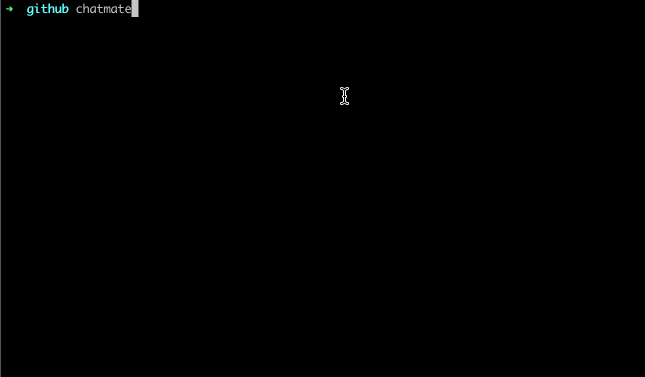

# Chatmate

可以让你在命令行使用 ChatGPT 的工具，如果你也一样受不了 ChatGPT 的聊天页面经常崩溃，那么你来对地方了。



## 🛫 使用前提

1. 科学上网（需要可以切换节点到国外的）
2. 需要注册一个 ChatGPT 的账号，不会的可自行百度，很多教程。没有国外手机号也可以租~
3. 安装 Node 环境，详见[官网](https://nodejs.cn/download/)

## 💻 配置终端代理

因为代理软件一般不能直接对终端发起的请求进行代理，所以这里可能需要配置终端的代理（如果你没问题可直接跳过）。

这里以我的代理 `clash` 在 `zsh` 终端配置为例：

首先，打开配置文件

```bash
open ~/.zshrc
```

然后添加对应的规则代理：

```bash
#  按需开启即可，这里只需要代理 https 请求，所以只配置 https 代理
export https_proxy=http://127.0.0.1:%mixedPort%
# export http_proxy=http://127.0.0.1:%mixedPort%
# export all_proxy=socks5://127.0.0.1:%mixedPort%
```

让配置生效

```bash
source ~/.zshrc
```

## 🎉 开始吧

**方式 1**：直接运行：

```bash
npx chatmate
```

**方式 2**：全局安装

```bash
npm install -g chatmate
```

然后运行

```bash
chatmate
```

更推荐方式 2，一次安装，后续即可多处使用，且不用输入 API key。

## 更新软件

```bash
npm update -g chatmate
```

## 👨‍💻 贡献

如果您对本项目有问题或者想法，欢迎新建一个 [Issue](https://github.com/onechunlin/side-projects/issues) 进行讨论~

非常欢迎参与到项目的贡献中，一起为爱发电！

最后，如果您觉得本工具对你有帮助的话，欢迎给个 star，这将是我不断更新的动力~😉
